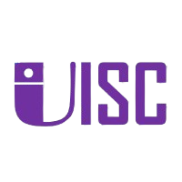
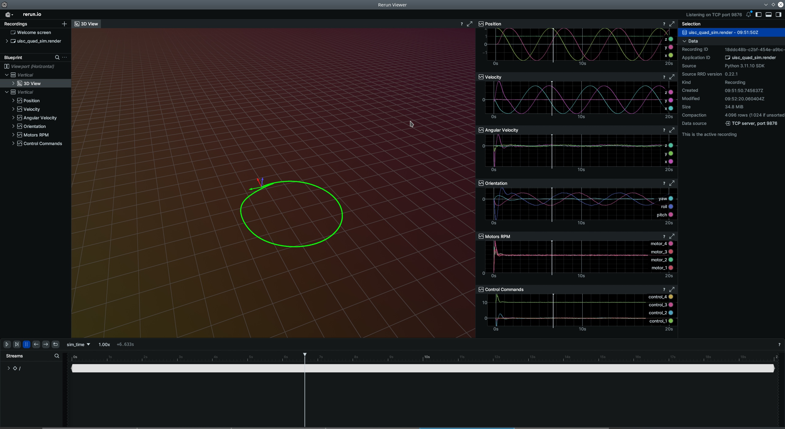

<a id="readme-top"></a>
<!-- PROJECT LOGO -->
<br />
<div align="center">
  <a href="https://github.com/CQU-UISC/px4ctrl_client">
    
  </a>
  <h3 align="center">UISC Lab QuadSim</h3>
  
</div>

<!-- ABOUT -->
## About

The **UISC Quadrotor Simulator** is a flexible simulation platform for quadrotor dynamics and control algorithms. Key features include:

- **Dynamics Model**: First-order motor dynamics based on [UZH-RPG's framework](https://github.com/uzh-rpg) with configurable quadrotor parameters (mass, inertia, thrust coefficients).
- **Control Modes**: Supports CTBR (Collective Thrust + Body Rates), CTBM (Collective Thrust + Body Moments), and SRT (Single Rotor Thrusts) control interfaces.
- **Vectorized Simulation**: Run multiple quadrotor instances in parallel for large-scale experiments.
- **Visualization**: Real-time visualization using [rerun](https://github.com/rerun-io/rerun).
- **Sensor Simulation**: IMU, LiDAR, and camera sensors (under development).
- **Disturbance Models**: Wind, Constant Force, Constant Torque, and more.
- **Pure Python** implementation for easy integration with reinforcement learning frameworks.


*Upcoming: Gym-compatible environment wrapper for reinforcement learning applications.*

<!-- GETTING STARTED -->
## Getting Started

### Prerequisites
- Python ≥ 3.10 (optional, for future Gym wrapper)

### Installation

   ```bash
   git clone https://github.com/CQU-UISC/uisc-quad-sim.git
   cd uisc-quad-sim
   python3 -m pip install -e .
   ```

<!-- USAGE EXAMPLES -->
## Usage

Run a simulation with the CTBR controller and visualize with rerun:
```bash
python3 -m uisc_quad_sim.examples.examplectrl
```



*Example: Trajectory tracking with body-rate control.*

<!-- ROADMAP -->
## Roadmap

- [x] Core dynamics and CTBR/CTBM/SRT interfaces
- [x] Rerun visualization integration
- [ ] Sensor simulation (IMU, LiDAR, camera)
- [ ] Gym environment wrapper
- [ ] ROS 2 compatibility
- [ ] Documentation and tutorials

<!-- CONTACT -->
## Contact

**Xu Lu** - [lux@cqu.edu.cn](mailto:lux@cqu.edu.cn)   
**GitHub Organization**: [CQU-UISC](https://github.com/CQU-UISC)

<!-- ACKNOWLEDGMENTS -->
## Acknowledgments

This project leverages the following organizations and projects:
- [UZH-RPG](https://github.com/uzh-rpg)
- [Peng](https://github.com/makeecat/Peng)
- [DATT](https://github.com/KevinHuang8/DATT)
- [rerun](https://github.com/rerun-io/rerun)

Special thanks to the [RPG](https://rpg.ifi.uzh.ch/) at UZH for their foundational work in quadrotor control.

<p align="right">(<a href="#readme-top">back to top</a>)</p>